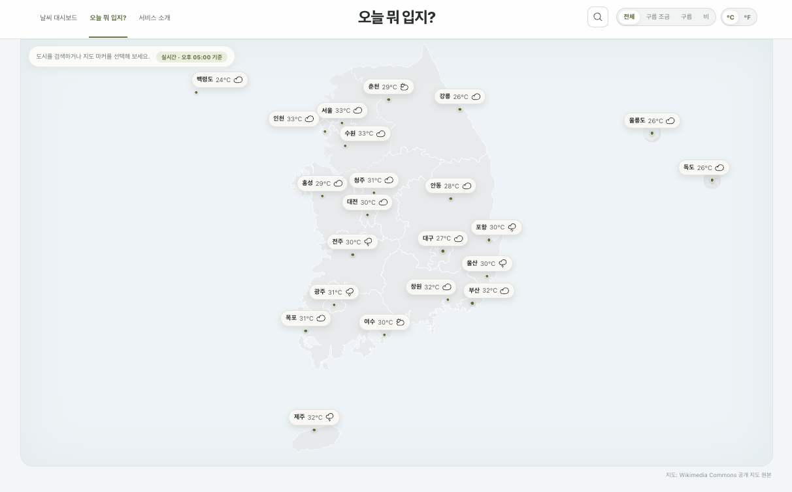
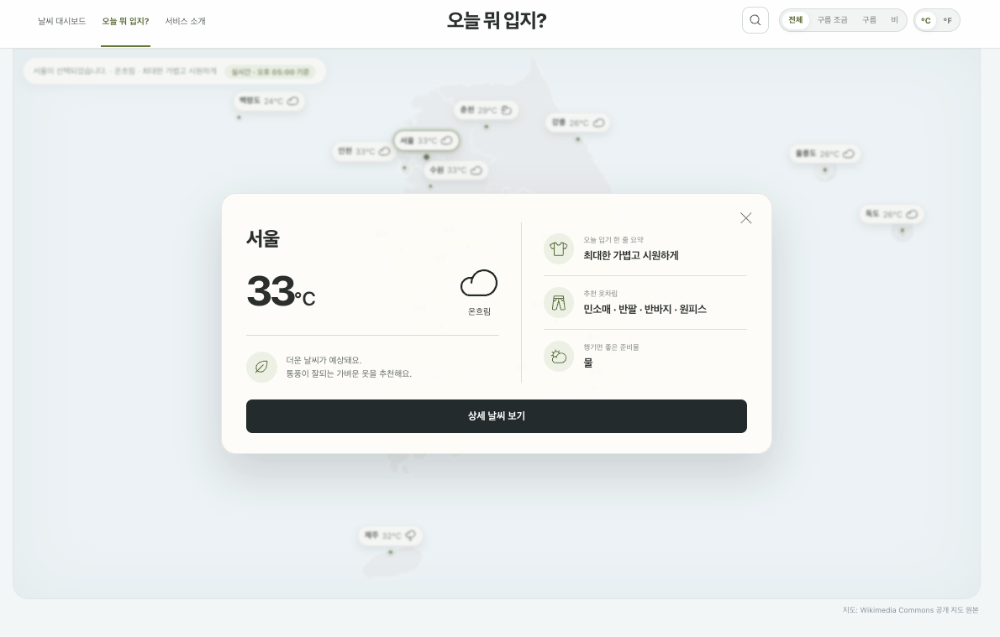
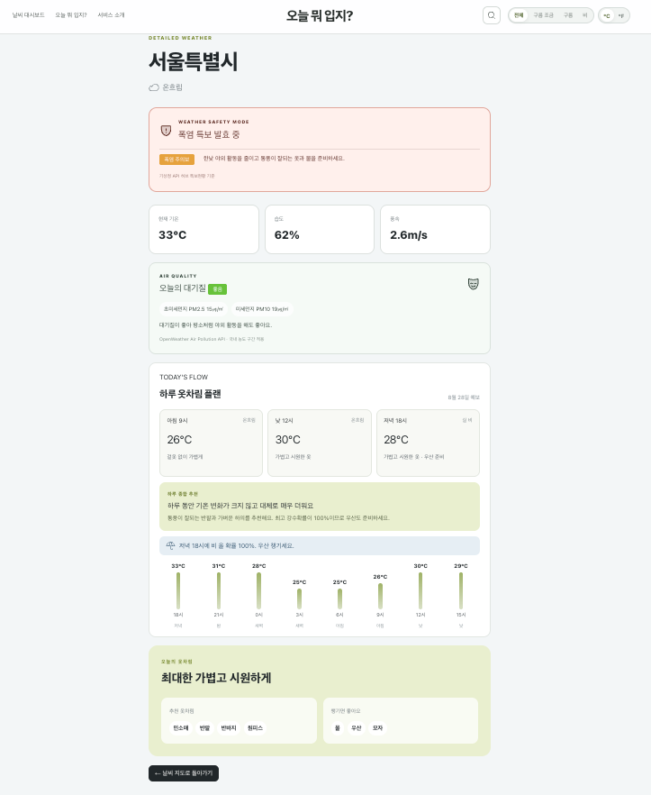
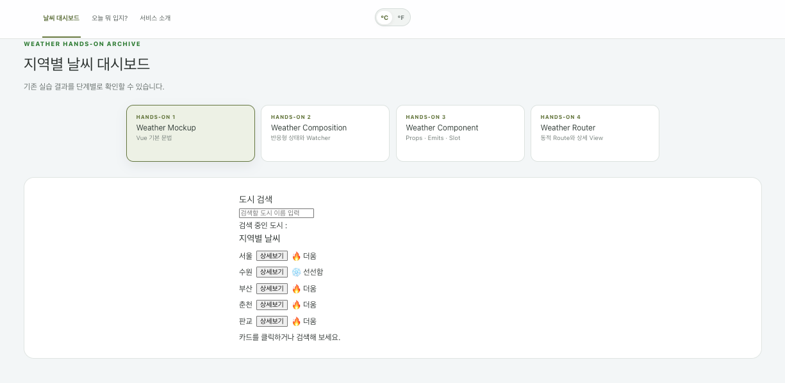

# 오늘 뭐 입지?

날씨 대시보드 Hands-on 과제(1~8단계)와, 그 위에 확장한 옷차림 추천 서비스 **"오늘 뭐 입지?"** 를 담은 Vue 3 프로젝트

전국 22개 도시의 실시간 날씨를 지도에 표시하고, 기온·예보·대기질·기상특보를 종합해 **오늘 무엇을 입고 무엇을 챙길지** 안내

### 👉 배포 주소 — _(배포 후 추가)_

접속 즉시 사용 가능 — 별도 설치나 API Key 발급 불필요

---

## 1. 화면 구성

### 오늘 뭐 입지? — 지도

22개 도시의 실시간 기온·날씨를 위경도로 투영해 배치. 상단에서 도시 검색·날씨 필터·온도 단위를 조작



### 옷차림 팝업

마커를 누르면 기온·날씨와 함께 한 줄 요약·추천 옷차림·준비물을 표시



### 옷차림 상세

기상특보 안전 모드, 대기질 등급, 아침·낮·저녁 하루 플랜, 시간대별 기온 흐름을 한 화면에 제공



### 날씨 대시보드 — Hands-on 아카이브

Hands-on 1~4의 실습 결과를 탭으로 전환하며 확인



### 라우트

| 경로                       | 화면              | 설명                                          |
| -------------------------- | ----------------- | --------------------------------------------- |
| `/`                        | 날씨 대시보드     | Hands-on 1~4 실습 결과를 탭으로 전환하며 확인 |
| `/weather/:cityId`         | 지역 상세         | 동적 라우트로 받은 도시의 상세 기상 정보      |
| `/about`                   | 서비스 소개       | 정적 페이지 (Lazy Loading)                    |
| `/clothes`                 | **오늘 뭐 입지?** | 22개 도시 마커, 검색, 날씨 필터, 옷차림 팝업  |
| `/clothes/weather/:cityId` | **옷차림 상세**   | 시간대별 계획·대기질·기상특보·옷차림 추천     |
| `/:pathMatch(.*)*`         | 404               | Catch-all                                     |

---

## 2. 단계별 구현 및 개인 Customization

### Hands-on 1 — Weather Mockup

`components/exercise/WeatherMockup.vue`

**요구사항 충족** · `v-for` + `:key` 배열 렌더링 / 기온 25℃ 기준 `v-if` 라벨 / `:value`+`@input` 한글 검색 / 카드 클릭 상태바 표시 + `@click.stop` 상세보기

**Customization**

- 기본 3개 도시 → **춘천·판교 추가**
- alert에 기온 정보 추가 (`{도시}의 현재 날씨는 [{상태}]이며, 기온은 {N}°C입니다.`)

> **설계 판단** — 검색창은 `v-model` 한 줄로 대체 가능하나, 한글 입력 처리를 직접 확인하라는 요구사항에 따라 `:value` + `@input` 유지. 단 문자열 포함 방식이라 `서`·`수` 같은 완성 음절만 검색되고 `ㅅ` 같은 초성 검색은 불가 — 초성 분리 로직이 별도로 필요해 과제 범위에서 제외
>
> 이벤트 수식어는 실제 문제 해결에 사용. 지도 마커·팝업 내부 클릭 시 지도 클릭까지 함께 실행되어 팝업이 닫히는 버블링 발생 → `.stop`으로 전파를 끊어 **지도 빈 곳 클릭 시에만** 닫히도록 범위 분리

### Hands-on 2 — Weather Composition

`components/exercise/WeatherComposition.vue`

**요구사항 충족** · `ref` 반응형 상태 3종 / `computed` 검색 필터 / `watch`(선택 도시) + `watchEffect`(검색어) / 검색 결과 3분기 처리

**Customization**

- **사용자가 직접 설정하는 "더움 기준 온도"**(`hotThreshold`) 추가
- 기준 온도 이상 도시를 계산하는 `hotCities` computed 추가
- 기준 온도 변경을 감시하는 watcher 추가

### Hands-on 3 — Weather Component

`components/exercise/`

**요구사항 충족** · `WeatherParent` / `BaseDashboardCard`(slot) / `SearchBar`(props·emits) / `WeatherCard`(props·emits) 4개 분리, 각 컴포넌트 `<style scoped>` 분리

**Customization**

- **`WeatherStatusFilter.vue` 추가** — 날씨 상태별 필터. 목록은 원본 데이터에서 `new Set`으로 자동 생성
- 오늘 뭐 입지? 쪽에도 같은 패턴 적용 — `BaseMapPanel`(named slot), `ClothesSearchBar`, `ClothesCityMarker`, `ClothesWeatherFilter`, `ClothesWeatherPopup`

> **설계 판단** — `WeatherCard`의 `click-detail`은 이름·상태·기온을 각각 넘기는 대신 **도시 객체 하나**를 전달. 같은 컴포넌트를 쓰는 부모가 필요한 값만 선택 사용 가능(`WeatherParent`는 alert, `WeatherHomeView`는 `router.push`) → 결합도 감소

### Hands-on 4 — Weather Router

`router/index.js`

**요구사항 충족** · 첫 화면 정적 import / 나머지 Lazy Loading / Catch-all / `RouterLink`·`RouterView` / `:cityId` 동적 세그먼트 / `router.push` Programmatic Navigation

**Customization**

- **`/clothes`, `/clothes/weather/:cityId` 추가 View 및 Routing** — "오늘 뭐 입지?" 서비스
- 메인 대시보드를 **Hands-on 1~4 아카이브**로 구성해 단계별 결과를 탭으로 비교
- 검색어를 URL Query String과 동기화

### Hands-on 5 — Weather Store

`stores/`

**요구사항 충족**

| 구분   | 이름         | 내용                         |
| ------ | ------------ | ---------------------------- |
| state  | `unit`       | 온도 단위 (초기값 `celsius`) |
| getter | `unitSymbol` | 현재 단위 기호 (`℃` / `℉`)   |
| action | `toggleUnit` | 섭씨 ↔ 화씨 전환             |

`UnitToggler.vue`를 Navigation Bar 옆에 배치. **7개 표시 지점 전부**가 토글에 반응

```
메인 대시보드 카드 · 지역 상세 · 지도 마커 · 옷차림 팝업
· 옷차림 상세 · 시간대별 예보 띠 · 단위 기호
```

**Customization**

- **`weatherStore.js` 추가** — 날씨 목록, 검색어, 선택 도시, 필터, API 연동, 예보·대기질·특보 캐시를 한곳에서 관리
- `configStore`에 **`convertTemperature` 액션 추가**

> **설계 판단** — 과제 자료는 단위 변환 코드의 View 간 중복을 "Composable로 해결 가능(범위 제외)"로 남겨둠. 이 프로젝트는 **변환 로직을 `configStore.convertTemperature()` 하나로 집약**해 해결. 변환 규칙과 단위 상태가 같은 Store 안에 있어 단위 변경 시 이를 쓰는 모든 화면이 자동 갱신
>
> **더움 판정은 항상 원본 섭씨로** 계산 — 화면 표시만 변환하므로 ℉ 모드에서도 판정 불변

### Hands-on 6 — Weather Axios

`api/`, `src/api/`

**요구사항 충족**

1. **실제 날씨 데이터 적용** — OpenWeatherMap `/weather`로 22개 도시 실시간 조회
2. **OpenWeatherMap 추가 API** — `/forecast`(예보), `/air_pollution`(대기질), `/geo/1.0/direct`(지역 검색)
3. **기타 외부 API** — 기상청 API 허브 `특보현황 조회`

**Customization**

- **시간대별 옷차림 변화** — 3시간 단위 예보를 24시간 막대 띠로 표시. 일교차 8도 이상이면 **"겉옷 챙기세요"**, 강수 확률 50% 이상 시간대가 있으면 **"우산 챙기세요"**
- **아침·낮·저녁 3구간 계획** — 각 시간대에 가장 가까운 예보를 골라 기온·날씨·조언을 카드로 제시. 하루 흐름을 한 문장으로 요약하고 최저·최고 기온에 맞는 **레이어링 조언**을 덧붙임
- **대기질 연동** — PM10·PM2.5를 AirKorea 기준으로 등급화. 나쁨 이상이면 준비물에 **보건용 마스크** 추가
- **기상특보 연동** — 폭염·한파·호우·대설·태풍·강풍 특보를 지역별로 매칭해 안전 행동과 준비물 안내
- **지도에 없는 지역 검색** — Geocoding으로 한글 검색(예: `성남` → 성남시). 결과를 지도에 **임시 마커**로 표시하고, 마커를 누르면 팝업이 열림. 검색어를 지우거나 새로고침하면 사라짐
- **자동 갱신** — 10분마다 재조회. 데이터 출처 배지를 누르면 즉시 갱신

> **호출량 설계** — 지도 진입 시 22건, 상세 화면 진입 시 해당 도시만 예보·대기질·특보 각 1건 호출 후 캐시. `Promise.allSettled` 사용 → 일부 도시가 실패해도 나머지 결과는 그대로 표시
>
> **시각 처리** — 예보 응답의 `dt_txt`는 UTC 기준 → 도시 `timezone` 오프셋을 더해 현지 시각으로 변환해야 "아침·낮·밤" 표기가 정확
>
> **예보 구간 선택** — 예보가 정확히 08·13·19시에 오지 않아, 앞에서부터 세 개를 고르면 **서로 다른 날짜의 예보가 한 추천에 혼재.** 따라서 ①같은 날짜의 예보만 후보로 한정 ②아침·낮·저녁 목표 시간에 최근접 슬롯 선택 ③세 시간대가 모두 있는 날에만 하루 종합 추천 생성. 데이터 부족 시 계산 생략
>
> **실패 시 화면 설계** — 실시간 API만 기준으로 구성하면 Key 미설정·네트워크 오류·호출 제한·데이터 누락 시 화면 공백 발생. Mock Data를 기본값으로 유지하고 **요청 성공 시에만 갱신** → 어떤 실패에서도 화면은 채워진 상태 유지. 로딩은 `el-skeleton`, 오류는 `el-alert`, 실시간·임시 여부는 배지로 구분

> **외부 API 선택 과정** — 당초 Pinterest의 패션 이미지로 추천 옷차림 예시를 제공하려 했으나, Pinterest API는 일반 검색 결과를 자유롭게 가져올 수 없고 개인 보드 연결 시 사용자가 제한됨. Unsplash·Pexels도 검토했으나 날씨에 정확히 대응하는 코디 이미지를 안정적으로 확보하기 어려움
>
> 이미지 기능을 억지로 추가하는 대신 **날씨 데이터 분석과 추천 품질 강화**를 선택 → 그 결과가 위의 예보·대기질·특보 연동. 외부 API는 개수보다 서비스 목적 부합 여부가 중요하다고 판단

### Hands-on 7 — UI Library

**Element Plus** 적용. API 응답 대기 구간과 실패 안내를 직접 구현하지 않고 라이브러리 컴포넌트로 통일

| 컴포넌트      | 사용처                      |
| ------------- | --------------------------- |
| `el-skeleton` | 예보·대기질·특보 로딩 중    |
| `el-alert`    | 조회 실패 안내              |
| `el-tag`      | 특보 등급, 대기질 등급 배지 |
| `ElMessage`   | 수동 갱신 성공·실패 토스트  |

아이콘은 `@phosphor-icons/vue`로 이모지·텍스트 기호 대체

> **적용 범위 판단** — 모든 버튼·카드를 라이브러리 컴포넌트로 교체하면 지도·팝업 등 기존 디자인의 개성 소실. 따라서 **공통 상태 표현(로딩·오류·배지·토스트)에만 제한 적용**하고 나머지 디자인은 유지
>
> Element Plus 기본 파란색이 서비스 톤과 불일치 → `--el-color-primary` 등 CSS 변수를 올리브·오프화이트 계열로 재정의. 기상특보는 초기에 `폭염`과 `주의보`를 별도 Tag로 표시했으나 하나의 의미가 분리되어 어색 → `폭염 주의보` 단일 Tag로 통합

> **설계 판단** — `app.use(ElementPlus)` 전역 등록은 실제 사용 컴포넌트가 3종뿐이어도 라이브러리 전체를 번들에 포함. 측정 결과 메인 번들이 **182 kB → 1,095 kB**(gzip 68 → 355 kB)로 6배 증가, Vite도 청크 크기 경고 출력
>
> `unplugin-vue-components` + `ElementPlusResolver`로 **온디맨드 방식** 전환 → **189 kB(gzip 71 kB)** 로 복귀. Element Plus를 쓰면서도 도입 전 대비 3 kB 증가에 그침. 템플릿 태그가 아닌 `ElMessage`는 리졸버가 감지하지 못해 해당 스타일만 직접 import

### Hands-on 8 — Build & Deployment

- `npm run lint` 무오류 (oxlint + ESLint)
- `npm run format:check` 통과 — 검사 범위를 `src/`에서 **프로젝트 전체**로 확대
- **API Key를 서버리스 함수로 이전** — 빌드 결과물에 키가 포함되지 않음 → [5. API 중계 구조](#5-api-중계-구조)
- 번들 크기 최적화 (Hands-on 7 참고)
- `vercel.json`으로 SPA 딥링크 대응 — `/clothes/weather/city_01`로 직접 접속하거나 새로고침해도 정상 동작
- 미사용 스캐폴딩 파일 정리

**Vercel 환경 변수 등록** (Project Settings → Environment Variables)

| 이름                  | 값                              |
| --------------------- | ------------------------------- |
| `OPENWEATHER_API_KEY` | 발급받은 OpenWeatherMap 키      |
| `KMA_API_KEY`         | 발급받은 기상청 API 허브 인증키 |

---

## 3. "오늘 뭐 입지?" 주요 기능

### 옷차림 추천 로직

`views-clothes/clothesWeatherData.js`

기온을 **8구간**으로 나눠 한 줄 요약·추천 옷차림·추천 근거를 결정하고, 여기에 조건별 준비물을 추가

| 기온   | 한 줄 요약                 |
| ------ | -------------------------- |
| 28℃ ↑  | 최대한 가볍고 시원하게     |
| 23~27℃ | 반팔 중심의 가벼운 옷차림  |
| 20~22℃ | 얇은 긴팔이나 가디건 한 겹 |
| 17~19℃ | 가벼운 니트와 겉옷 챙기기  |
| 12~16℃ | 쌀쌀함을 막아줄 재킷 필요  |
| 9~11℃  | 도톰한 겉옷으로 따뜻하게   |
| 5~8℃   | 코트와 보온 이너 챙기기    |
| 4℃ ↓   | 패딩과 방한용품으로 보온   |

준비물은 **현재 날씨 + 예보 + 대기질 + 특보**를 합쳐 결정. 비 예보 시 우산, 일교차가 크면 얇은 겉옷, 대기질 나쁨 이상이면 보건용 마스크, 특보 발효 중이면 해당 특보의 권장 물품 추가

### 안전 모드

기상특보 발효 중이면 상세 화면 최상단에 **안전 모드 카드** 우선 표시. 특보 종류·등급과 안전 행동을 안내하고 준비물에도 반영 (폭염 → 물·모자 / 한파 → 두꺼운 외투·장갑 / 호우 → 우산·방수 겉옷 등)

기상청 응답은 코드형(`H`, `C`, `R`…)과 한글형(`폭염`, `한파`…)이 혼재하고 해제 코드(CMD 3·4·7)를 포함 → 두 형식을 모두 처리하고 해제된 특보는 제외

### 지도 좌표계

지도 위 마커는 **위경도를 투영해 계산**. 수작업 좌표가 아니라 지도 이미지와 동일한 변환식을 사용하므로 창 크기가 바뀌어도 어긋나지 않음

- 배경 SVG는 `viewBox` 800×1200 중 실제 지형이 그려진 영역(x 106~708 / y 19~1175)만 프레임에 맞춰 노출
- 제주도 폭을 기준으로 축척을 역산한 뒤, **본토 남단 34.29°N(해남 땅끝)** 과 **동단 129.57°E(호미곶)** 로 검증
- 마커는 **정확한 위치를 나타내는 앵커 점**과 **읽기용 라벨**을 분리 — 라벨이 겹칠 때는 라벨만 이동하고 앵커 점은 고정
- 울릉도·독도는 실제 축척 적용 시 화면 이탈 → 동해상 고정 위치에 표시하되 섬 그림과 마커가 같은 좌표를 공유

### 표기 · 접근성

- 한글이 글자 단위로 잘리지 않도록 `word-break: keep-all` 적용. 추천 근거는 **문장 단위**로 줄바꿈
- 마커·토글·팝업에 `aria-label`, `aria-pressed`, `aria-live` 지정

---

## 4. 사용한 외부 API

| API                              | 용도             | 비고                                  |
| -------------------------------- | ---------------- | ------------------------------------- |
| OpenWeatherMap `/weather`        | 도시별 현재 날씨 |                                       |
| OpenWeatherMap `/forecast`       | 3시간 단위 예보  | 응답이 UTC라 도시 `timezone`으로 변환 |
| OpenWeatherMap `/air_pollution`  | PM10·PM2.5       |                                       |
| OpenWeatherMap `/geo/1.0/direct` | 지역 검색 (한글) |                                       |
| 기상청 API 허브 `wrn_now_data`   | 기상특보 현황    | CORS 미지원, EUC-KR 쉼표 구분 텍스트  |

모든 호출은 아래 중계 함수를 경유 — 브라우저는 API Key를 알지 못함

---

## 5. API 중계 구조

브라우저가 외부 API를 직접 호출하면 두 가지 문제 발생

1. **키 노출** — `VITE_` 환경변수는 빌드 시 값이 코드에 치환 → 배포된 JS에서 누구나 확인 가능
2. **CORS 차단** — 기상청 API 허브가 `Access-Control-Allow-Origin` 헤더를 반환하지 않아 브라우저가 응답을 폐기. 개발 중에는 Vite 프록시로 우회 가능하나, 빌드 결과물은 정적 파일뿐이라 배포 후 우회 수단 부재

두 문제를 서버리스 함수로 함께 해결

```
브라우저 ──(키 없음)──> /api/owm          ──(서버 환경변수 키)──> OpenWeatherMap
브라우저 ──(키 없음)──> /api/kma-warnings ──(서버 환경변수 키)──> 기상청 API 허브
```

- **키가 번들에 없음** — 빌드 결과물에서 두 키와 `appid`·`authKey` 문자열이 모두 제거된 것을 확인
- **CORS 문제 해소** — 브라우저는 같은 출처(`/api/...`)만 호출, 서버 간 통신에는 CORS 규칙 미적용
- **인코딩을 서버에서 처리** — 기상청 응답(EUC-KR)을 UTF-8로 변환 후 반환
- **공개 프록시 악용 차단** — `/api/owm`은 실제 사용하는 4개 엔드포인트와 파라미터만 화이트리스트로 허용, 그 외 요청은 400 거부
- **개발·배포가 같은 코드 사용** — `vite.config.js`가 동일 함수 파일을 개발 서버 미들웨어로 연결 → 두 환경 모두 `/api/*` 경로로 동작, 별도 CLI 불필요

### 환경 변수

배포 환경에서는 Vercel에 등록한 값을 서버리스 함수가 사용 — 방문자는 키 불필요

로컬에서 실시간 데이터를 보려면 키를 직접 발급받아 입력

```bash
cp .env.example .env.local
```

| 키                    | 용도                            | 발급처                                               |
| --------------------- | ------------------------------- | ---------------------------------------------------- |
| `OPENWEATHER_API_KEY` | 현재 날씨·예보·대기질·지역 검색 | [openweathermap.org](https://openweathermap.org/api) |
| `KMA_API_KEY`         | 기상특보 현황                   | 기상청 API 허브 (`특보현황 조회` 활용 신청)          |

- **`VITE_` 접두사 금지** — 접두사가 붙으면 값이 빌드 시 코드에 치환되어 브라우저 번들에 포함됨
- `.env.local`은 `.gitignore` 대상이라 저장소에 미포함 — 저장소에는 값이 빈 `.env.example`만 존재
- 키 추가·변경 시 **개발 서버 재시작** 필요

---

## 6. 폴더 구조

```
api/                             # Vercel 서버리스 함수 (배포 시 /api/* 로 노출)
├── owm.js                       # OpenWeatherMap 중계 (키를 서버에서 주입)
└── kma-warnings.js              # 기상청 특보 중계 (CORS 우회 + EUC-KR → UTF-8)

src/
├── main.js                      # Pinia · Router 전역 주입
├── App.vue                      # Navigation Bar + 지도 컨트롤(검색·필터·단위) + RouterView
├── router/index.js              # 라우트 정의, Lazy Loading, Catch-all
├── api/
│   ├── weatherApi.js            # 현재날씨 / 예보 / 대기질 / 지역검색 요청
│   └── kmaWarningApi.js         # 특보 요청 및 응답 파싱
├── utils/
│   └── airQuality.js            # PM10·PM2.5 → 대기질 등급 계산
├── stores/
│   ├── configStore.js           # 온도 단위(℃/℉) 전역 설정
│   └── weatherStore.js          # 날씨 목록·검색·필터·API 연동·캐시
├── components/
│   ├── exercise/                # Hands-on 1~3 실습 컴포넌트
│   └── clothes/                 # 오늘 뭐 입지? 전용 컴포넌트
└── views/
    ├── WeatherHomeView.vue      # 메인 대시보드
    ├── WeatherDetailView.vue    # 지역 상세
    ├── WeatherAboutView.vue     # 서비스 소개
    ├── NotFoundView.vue         # 404
    └── views-clothes/           # 오늘 뭐 입지? View + 도시 데이터 + 추천 로직
```

---

## 7. 로컬 실행

```bash
npm install
npm run dev   # http://localhost:3000
```

별도 설정 없이 실행 가능. **API Key가 없으면 내장 Mock Data로 전 화면 동작**하며, 지도 상단 배지가 `임시 데이터`로 표시

실시간 데이터를 로컬에서 보려면 → [5. API 중계 구조](#5-api-중계-구조)

### 기타 명령

```bash
npm run lint          # oxlint + ESLint
npm run format        # Prettier 적용
npm run format:check  # Prettier 검사만 (제출 전 확인용)
npm run build         # 프로덕션 빌드
npm run preview       # 빌드 결과 확인
```

---

## 8. 알려진 제약

- **서버리스 함수를 지원하는 호스팅 필요** — Vercel·Netlify에서는 그대로 동작하나, GitHub Pages처럼 정적 파일만 제공하는 호스팅에서는 `/api/*` 부재로 실시간 데이터 수신 불가(Mock Data로 표시)
- 검색으로 추가한 지역은 임시 표시 — 새로고침 시 소멸, 해당 URL 직접 접속 시 상세 정보 조회 불가
- 좁은 화면에서 22개 마커 라벨 일부 겹침 발생 가능
- 옷차림 추천은 기온 구간 기반 규칙 — 체감온도·개인차 미반영

---

## 9. 기술 스택

Vue 3 (Composition API, `<script setup>`) · Vue Router · Pinia · Axios · Element Plus · Vite · Phosphor Icons · ESLint + oxlint + Prettier

지도 자산: Wikimedia Commons 공개 지도 원본
